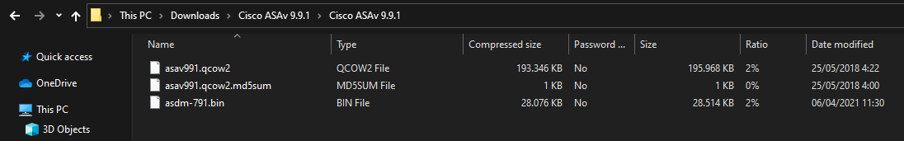
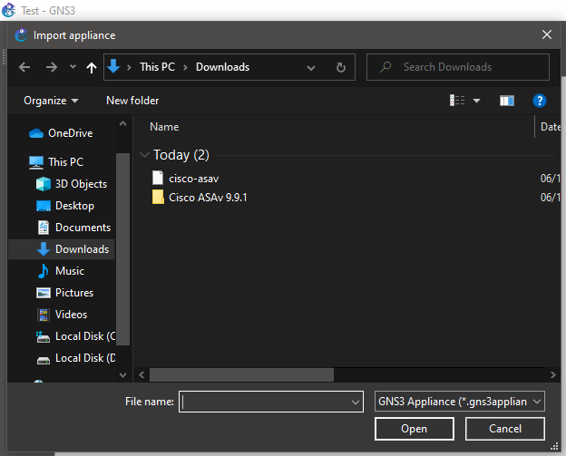
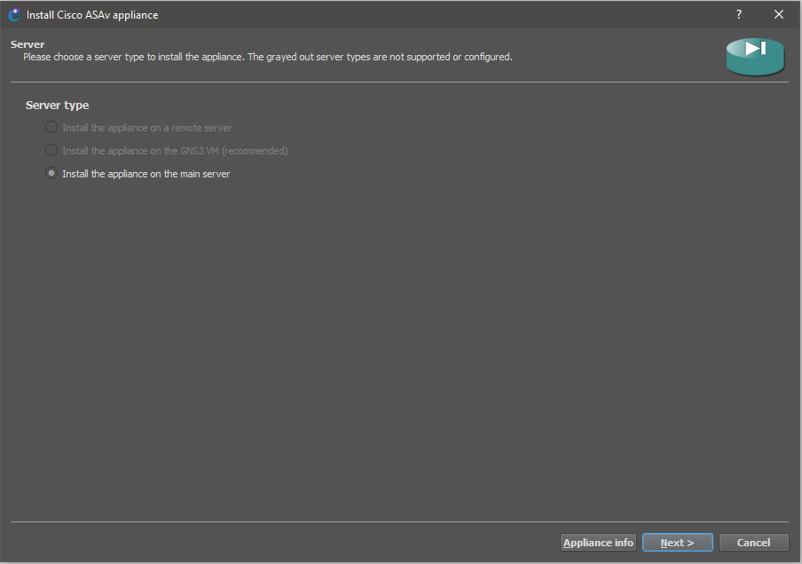
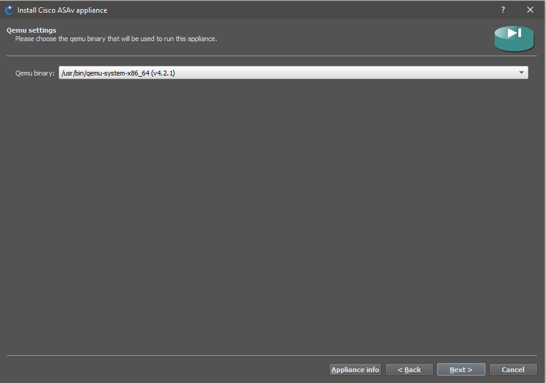
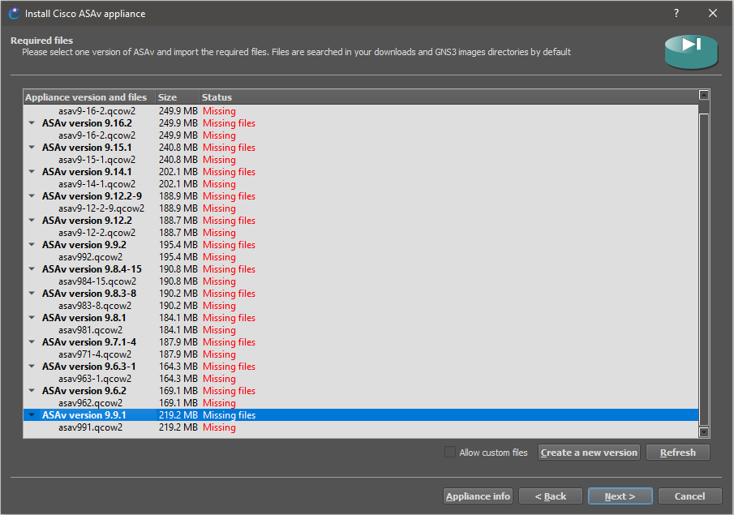
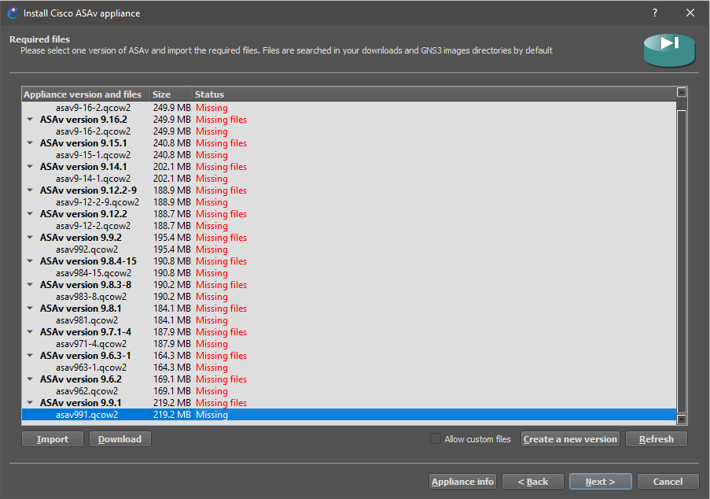
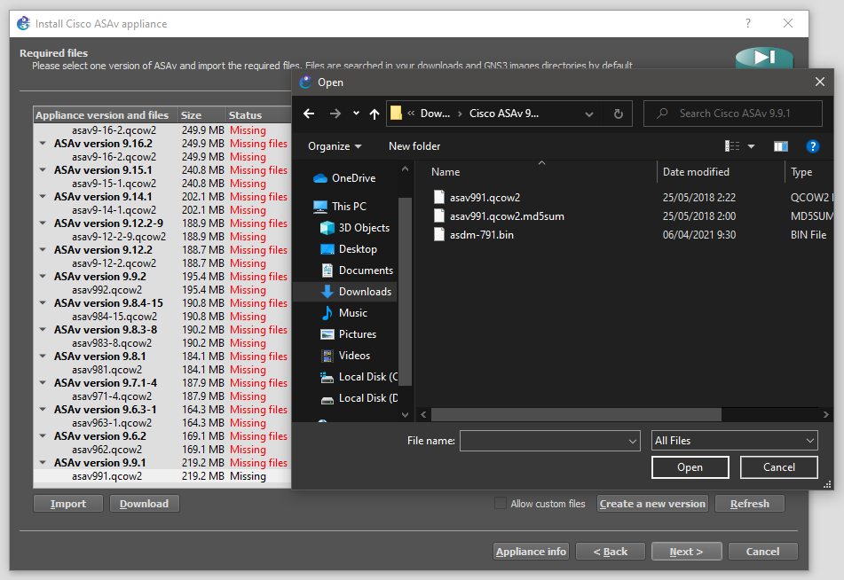
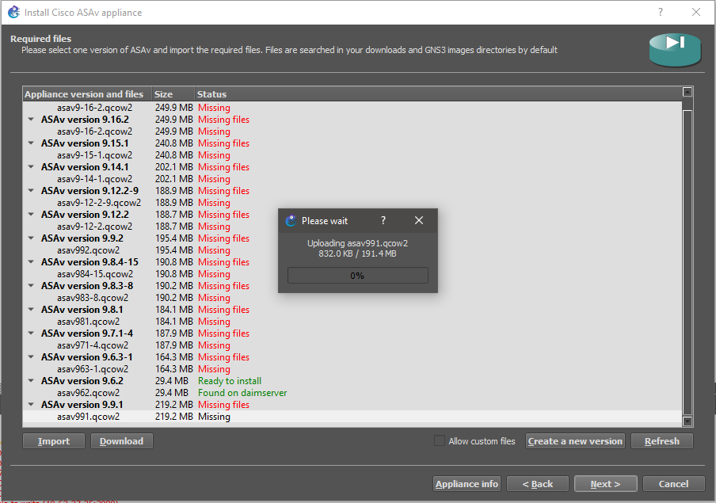
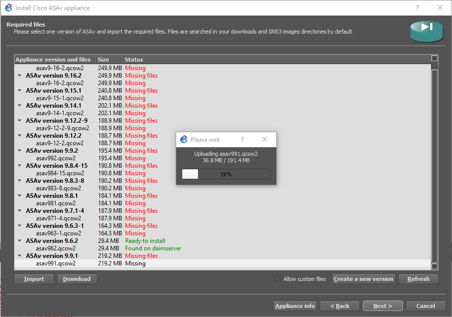
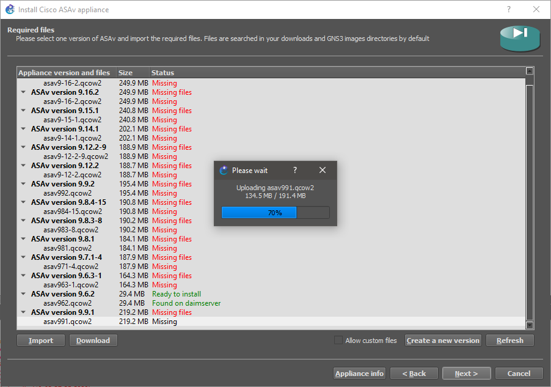

# Cisco Adaptive Security Virtual Appliance (ASAv)

- The **Fiwewall Layer** consists of the firewall ASAv-I.
- The *Cisco ASAv 9.9.1 Qemu* image can be downloaded as zip file which will be unzipped as [QEMU](https://drive.google.com/file/d/1oRBEiPqFOT9Ta_2QEB3U-SByy5k2PZ1d/view?usp=sharing).
- The *cisco-asav.gns3a* appliance also must be downloaded from [here](https://drive.google.com/file/d/1HoL0Ssser9Yl29s05jsRDl18L4ADqT0b/view?usp=share_link).
- The official *cisco-asav.gns3a* can be downloaded [here](https://www.gns3.com/gns3/appliance/download?url=https%3A%2F%2Fraw.githubusercontent.com%2FGNS3%2Fgns3-registry%2Fmaster%2Fappliances%2Fcisco-asav.gns3a). This not include *Cisco ASAv 9.9.1* version. The following section discusses how to add a new image to the appliance:

## How to add an image to appliance file 

1. Open the appliance file *cisco-asav.gns3a* with a text editor.

2. The *Cisco ASAv 9.9.1* zip file contains next three files:

    

3. Add the next configuration into `images` array:

    ```console
    {
        "filename": "asav991.qcow2",
        "version": "9.9.1",
        "md5sum": "40373fda0704d9272f89fd0bcbe4c69a",
        "filesize": 229871616,
        "download_url": "https://software.cisco.com/download/home/286119613/type/280775065/release/9.9.1"
    }
    ```

4. Add the next configuration into `versions` array:

    ```console
    {
        "name": "9.9.1",
        "images": {
            "hda_disk_image": "asav991.qcow2"
        }
    }
    ```

6. Save the appliance file *cisco-asav.gns3a*.

## How to add the appliance file

1. Select VM from GNS3 preferences:

    

2. Select VM from GNS3 preferences:

    

3. Select VM from GNS3 preferences:

    

4. Select VM from GNS3 preferences:

    

5. Select VM from GNS3 preferences:

    

6. Select VM from GNS3 preferences:

    

7. Select VM from GNS3 preferences:

    

8. Select VM from GNS3 preferences:

    

9. Select VM from GNS3 preferences:

    

10. Select VM from GNS3 preferences:

    