# Cisco vIOS-L2

- The **Core Layer** consists of the switches vIOS-Core-I and vIOS-Core-II.
- The *Cisco vIOS-l2 Qemu* image can be downloaded as [VMDK](https://drive.google.com/file/d/1Rf5zCpSgsaVNGaNgTCTFsdmir9doJ_b-/view?usp=sharing) and imported to GNS3 following next steps:

1. Select VM from GNS3 preferences:

    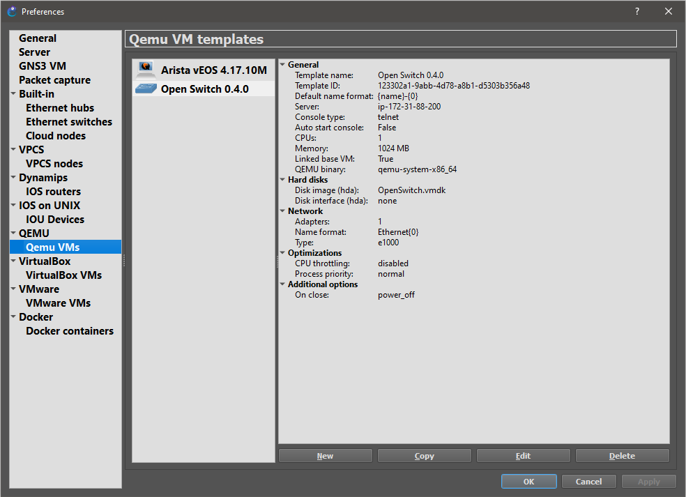

2. Select VM from GNS3 preferences:

    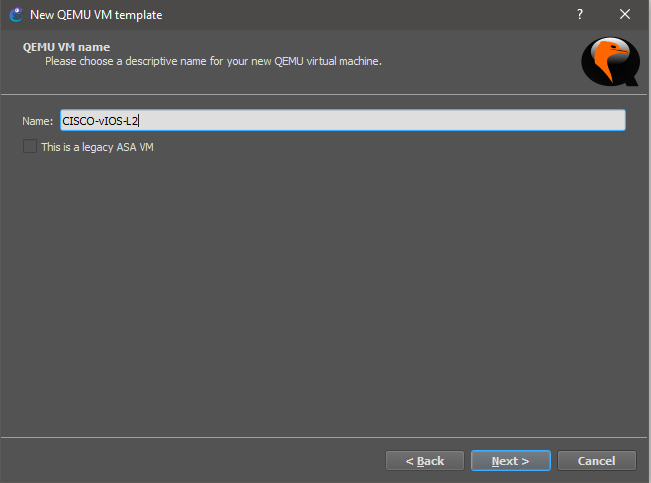

3. Select VM from GNS3 preferences:

    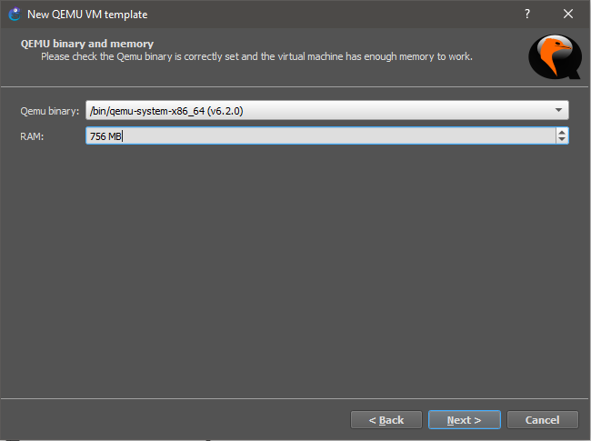

4. Select VM from GNS3 preferences:

    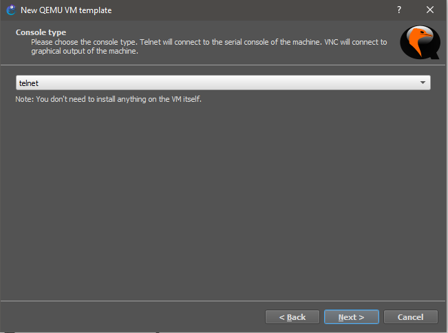

5. Select VM from GNS3 preferences:

    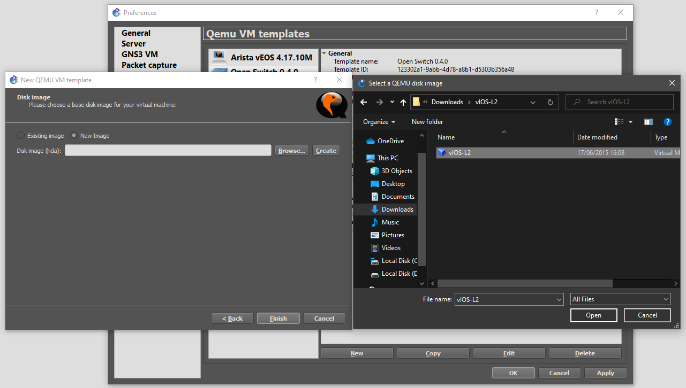

6. Select VM from GNS3 preferences:

    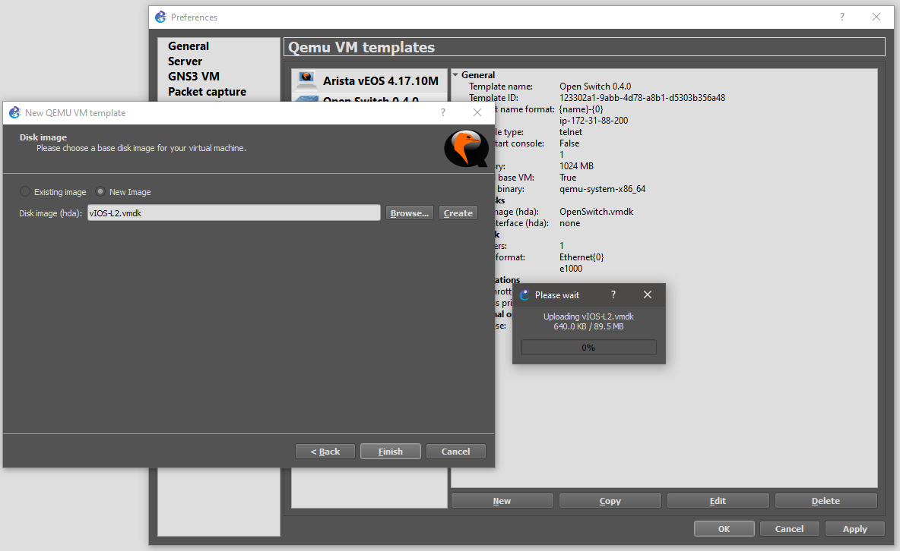

7. Select VM from GNS3 preferences:

    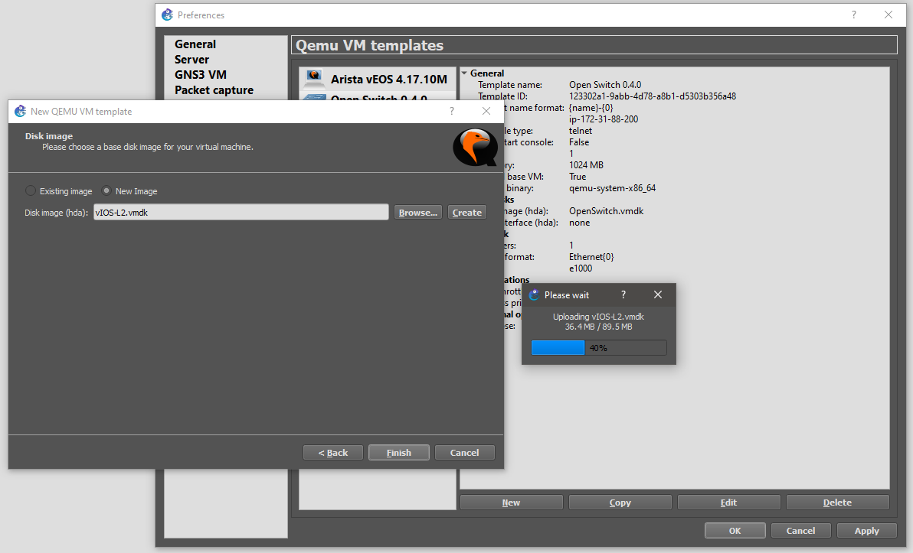

8. Select VM from GNS3 preferences:

    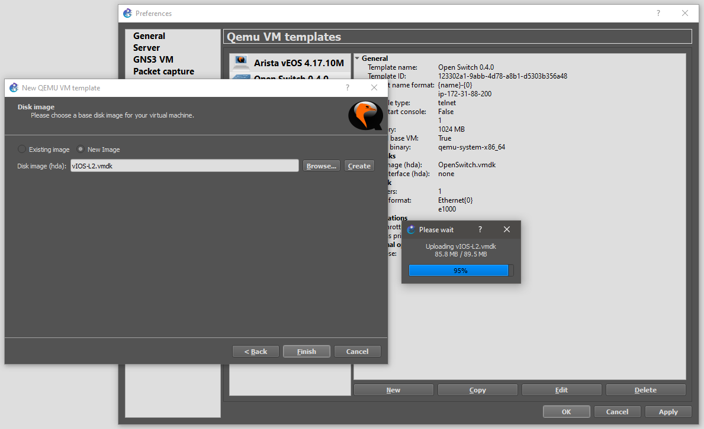

9. Select VM from GNS3 preferences:

    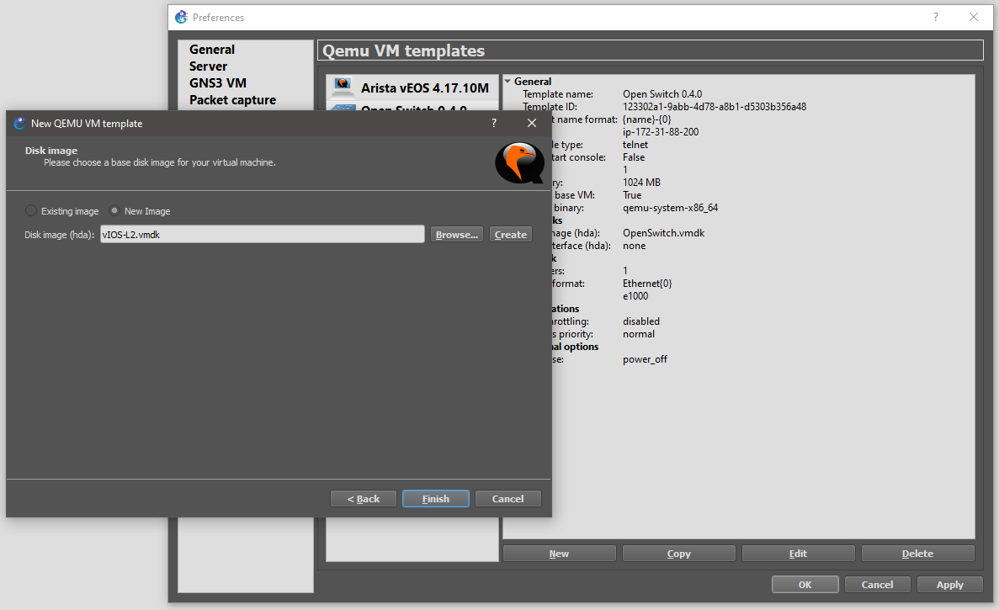

10. Select VM from GNS3 preferences:

    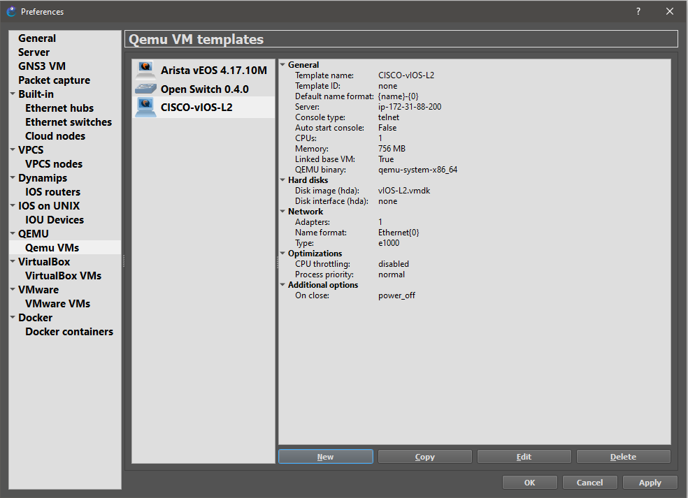

11. Select VM from GNS3 preferences:

    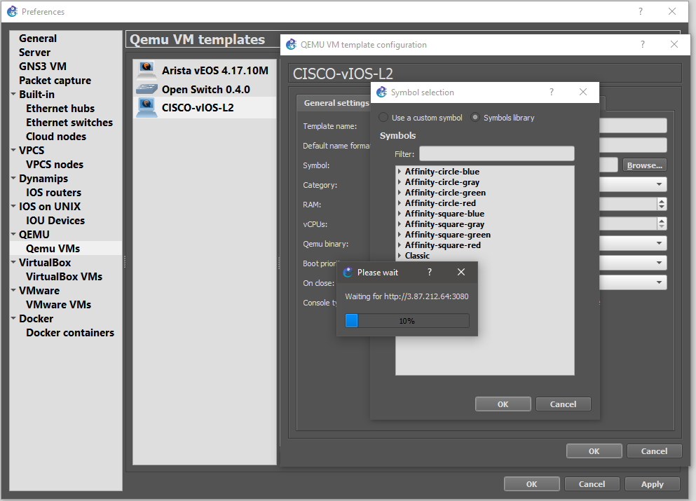

12. Select VM from GNS3 preferences:

    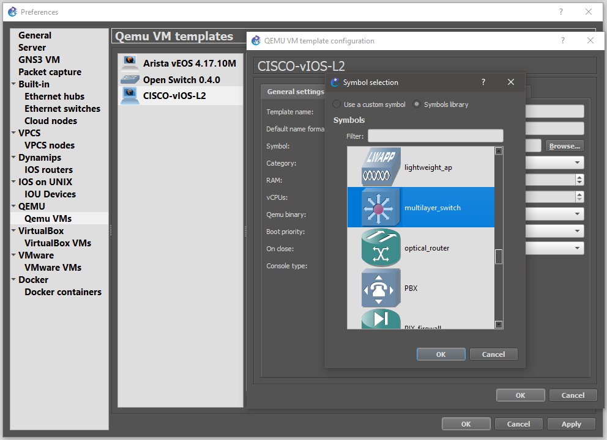

13. Select VM from GNS3 preferences:

    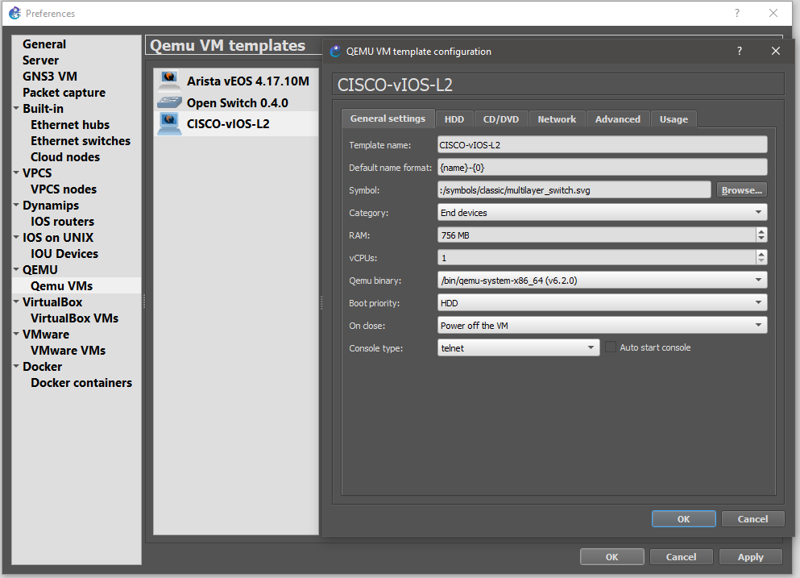

14. Select VM from GNS3 preferences:

    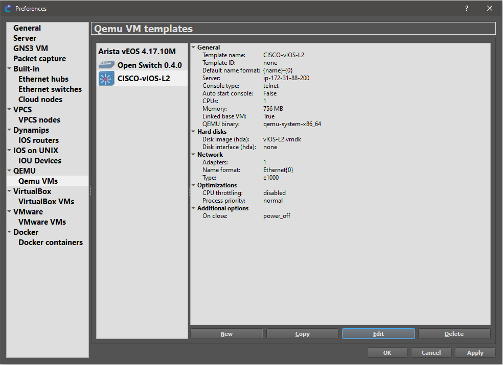

15. Select VM from GNS3 preferences:

    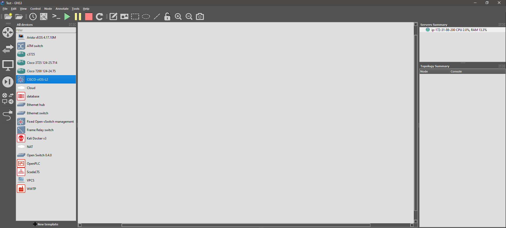

16. Select VM from GNS3 preferences:

    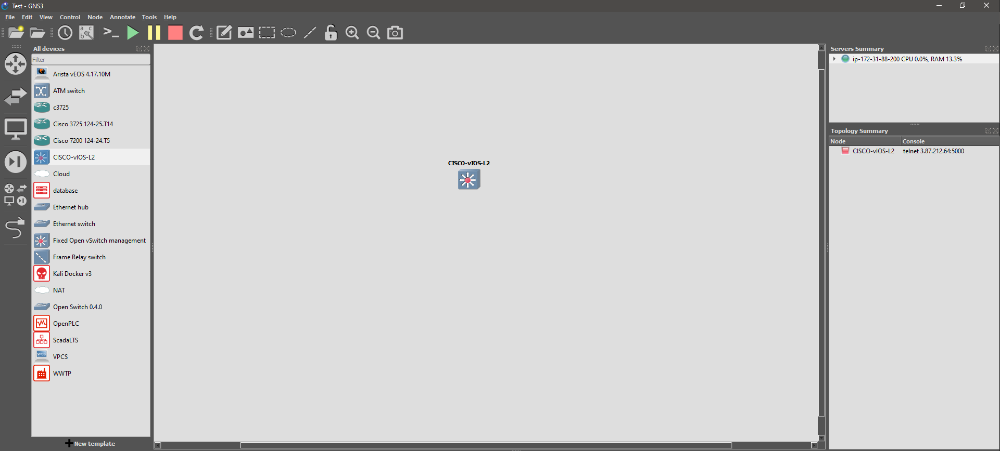

17. Select VM from GNS3 preferences:

    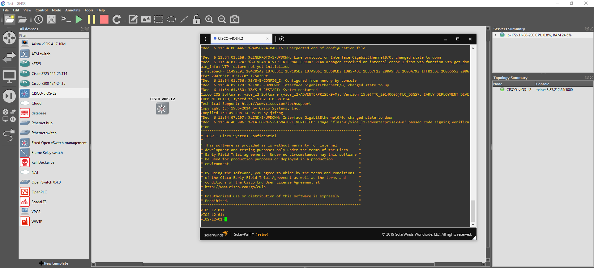
