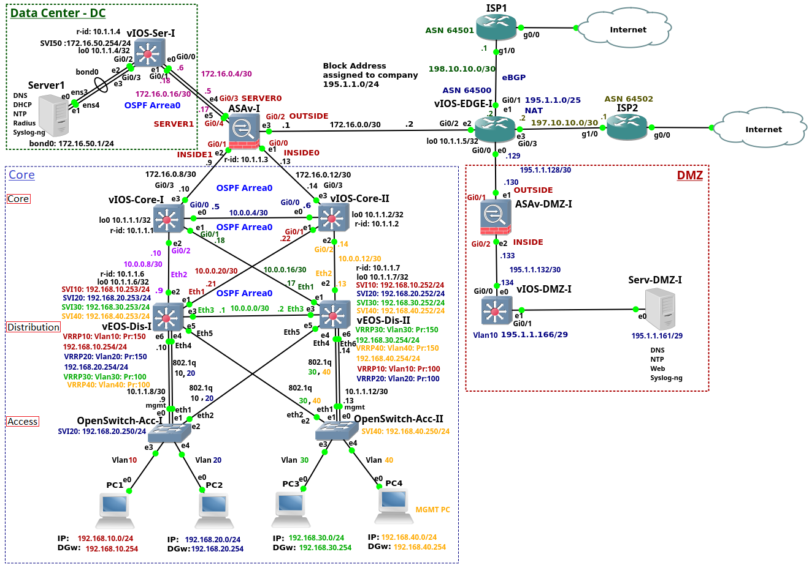

# Experimental Base Network on GNS3

- [Download current project status to be imported into GNS3](./ITNetwork.gns3project).

## Network Description

  

1. This network consists of 3 layers: *access*, *distribution* and *core*.
2. The *data center (DC)* is composed of the layer 3 Cisco switch and the server. The design of the DC is very simplified as the network tiers are squeezed to a single switch layer 3 switch. The aim is to show configuration of the services running on the Server1 instead of discussing the complete DC design.
3. The company *edge router* is connected to the Internet using two *Internet Service Providers (ISPs)*.
4. The *Cisco ASA firewall* connects a campus network, data Center and the *edge router*.
5. The *edge router* connected *DMZ* to the rest of the enterprise network and to the Internet. The DMZ consists of the *Cisco ASA firewall*, layer 3 Cisco switch and the *DMZ* server.
6. The enterprise is connected to the ISP1 and ISP2 routers via enterprise *edge router*. Both *ISP* routers  are bridged via *GNS3 clouds* to the server Ethernet Card in order to simulate connection to the Internet.

## Table of Devices and Images

| Devices | Images | Notes |
| --- | --- | --- |
| PC1-4 | GNS3 built-in VPCS | |
| OpenSwitch-Acc-I/II | [OpenSwitch-0.4.0.vmdk](https://drive.google.com/open?id=1u5CPt9_JVOd-cGBNEzPoAaWV7Dibe8vW) | @Deprecated |
| vEOS-Dis-I/II | [vEOS-lab-4.17.10M.vmdk](https://www.arista.com/en/support/software-download) + [Aboot-veos-serial-8.0.0.iso](https://www.arista.com/en/support/software-download) | login to Arista to download (free as a guest) |
| vIOS-Core-I/II, vIOS-Ser-I, vIOS-DMZ-I, vIOS-Edge-I | vIOS-L2 | |
| ASAv-I, ASAv-DMZ-I | ASAv | |
| ISP1/2 | Cisco 7206 | belongs to Cisco 7200 Series |
| Server1, Server-DMZ-I | [ubuntu server vmdk](https://cloud-images.ubuntu.com/) | major LTS version is OK |

## Building Layers

  The strategy for building the GNS3 network is to go from the bottom layer to the top layer.

### End devices

- To deploy only simple PC follows this [documentation](./../Devices-Configurations/devices_images/SimplePCs/README.md)

### Access Layer

1. Read this [documentation](./../Devices-Configurations/devices_images/Open_Switch_0.4.0/README.md) to add Open Switch 0.4.0 image to the **Access Layer**.
2. [Add this configuration on the Open Switch Access I](./../Devices-Configurations/config_files/OpenSwitch-Acc-I.txt)
3. [Add this configuration on the Open Switch Access II](./../Devices-Configurations/config_files/OpenSwitch-Acc-II.txt)

### Distribution Layer

1. Read this [documentation](./../Devices-Configurations/devices_images/Arista_vEOS_v4.17.2F/README.md) to add Arista vEOS version 4.17.2F image to the **Distribution Layer**.
2. [Add this configuration on the Switch Distribution I](./../Devices-Configurations/config_files/vEOS-DIS-I.txt)
3. [Add this configuration on the Switch Distribution II](./../Devices-Configurations/config_files/vEOS-DIS-II.txt)

### Core Layer

1. Read this [documentation](./../Devices-Configurations/devices_images/CISCO_vIOS-L2/README.md) to add the CISCO vIOS-L2 image to the **Core Layer**.
2. [Add this configuration on the Switch Core I](./../Devices-Configurations/config_files/vIOS-Core-I-1.txt)
3. [Add this configuration on the Switch Core II](./../Devices-Configurations/config_files/vIOS-Core-II-1.txt)

### Firewall Layer

1. Read this [documentation](./../Devices-Configurations/devices_images/ASAv/README.md) to add the Firewall ASAv image to the **Firewall Layer**.
2. [Add this configuration on the Firewall CISCO ASA](./../Devices-Configurations/config_files/vASA-I.txt)

## Other Layers

2. [Switch Data center](./../Devices-Configurations/config_files/vIOS-Serv-I.txt)
3. [Router Edge](./../Devices-Configurations/config_files/vIOS-EDGE-U.txt)
4. [Router ISP1](./../Devices-Configurations/config_files/ISP1.txt)
5. [Router ISP2](./../Devices-Configurations/config_files/ISP2.txt)
6. [Firewall CISCO ASA DMZ](./../Devices-Configurations/config_files/ASAv-DMZ-I.txt)
7. [Switch DMZ](./../Devices-Configurations/config_files/vIOS-DMZ-I.txt)
