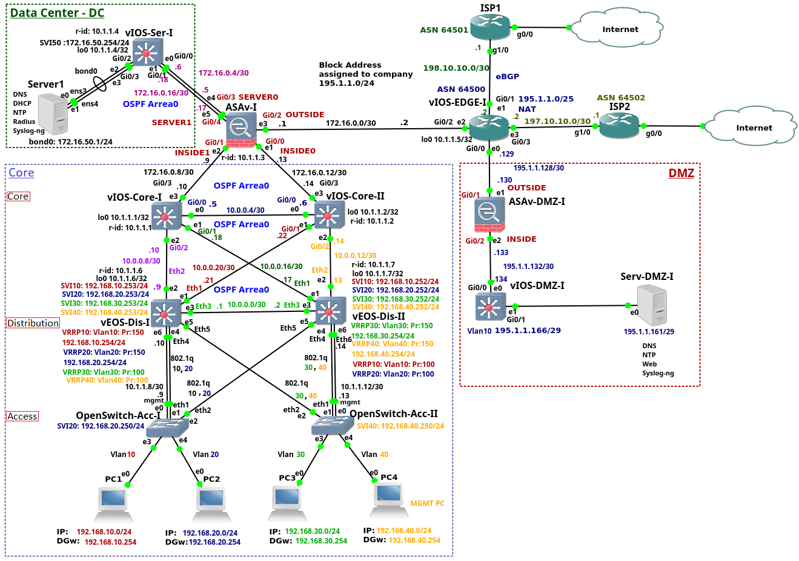

# Experimental Base Network on GNS3

- This network consists of 3 layers: *access*, *distribution* and *core*.

- The *data center (DC)* is composed of the layer 3 Cisco switch and the server. The design of the DC is very simplified as the network tiers are squeezed to a single switch layer 3 switch. The aim is to show configuration of the services running on the Server1 instead of discussing the complete DC design. 

- The company *edge router* is connected to the Internet using two *Internet Service Providers (ISPs)*.

- The *Cisco ASA firewall* connects a campus network, data Center and the *edge router*.

- The *edge router* connected *DMZ* to the rest of the enterprise network and to the Internet. The DMZ consists of the *Cisco ASA firewall*, layer 3 Cisco switch and the *DMZ* server.

- The enterprise is connected to the ISP1 and ISP2 routers via enterprise *edge router*. Both *ISP* routers  are bridged via *GNS3 clouds* to the server Ethernet Card in order to simulate connection to the Internet.

## Building Layers

The strategy for building the GNS3 network is to go from the bottom layer to the top layer.

### Field devices

### Access Layer

#### Configuration files
1. [Open Switch Access I](./config_files/OpenSwitch-Acc-I.txt)

2. [Open Switch Access II](./config_files/OpenSwitch-Acc-II.txt)

#### Donwload and deploy images

**Access Layer Switches** ares based on [Open Switch 0.4.0](./devices_images/Open_Switch_0.4.0/README.md) image.

### Distribution Layer

#### Configuration files

1. [Switch Distribution I](./config_files/vEOS-DIS-I.txt)
2. [Switch Distribution II](./config_files/vEOS-DIS-II.txt)

#### Donwload and deploy images

**Distribution Layer Switches** are based on [Arista vEOS version 4.17.2F](./devices_images/Arista_vEOS_v4.17.2F/README.md) image.

### Core Layer

## Configuration files

1. [Switch Core I](./config_files/vIOS-Core-I-1.txt)
2. [Switch Core II](./config_files/vIOS-Core-II-1.txt)

#### Donwload and deploy images

## Other Layers

7. [Firewall CISCO ASA](./config_files/vASA-I.txt)
8. [Switch Datacentre](./config_files/vIOS-Serv-I.txt)
9. [Router Edge](./config_files/vIOS-EDGE-U.txt)
10. [Router ISP1](./config_files/ISP1.txt)
11. [Router ISP2](./config_files/ISP2.txt)
12. [Firewall CISCO ASA DMZ](./config_files/ASAv-DMZ-I.txt)
13. [Switch DMZ](./config_files/vIOS-DMZ-I.txt)

## Devices/Images used

1. **Access Layer Switches** ares based on [Open Switch 0.4.0](./devices_images/Open_Switch_0.4.0/README.md) image.
2. **Distribution Layer Switches** are based on [Arista vEOS version 4.17.2F](./devices_images/Arista_vEOS_v4.17.2F/README.md) image.
