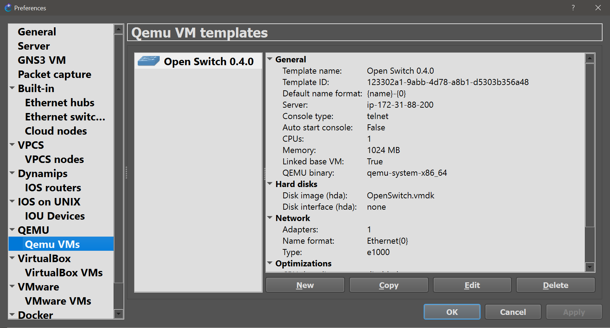
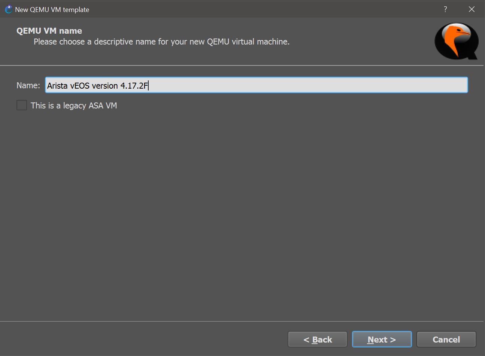
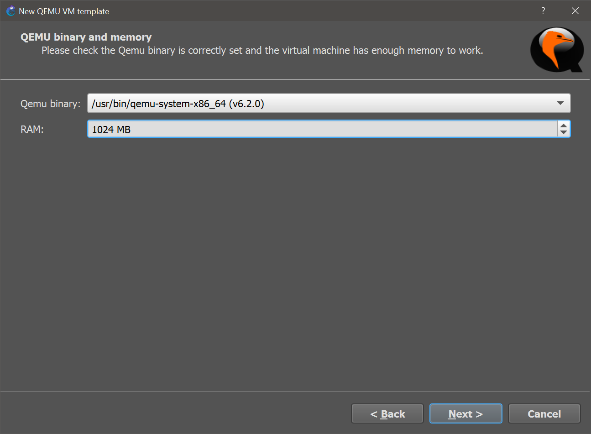
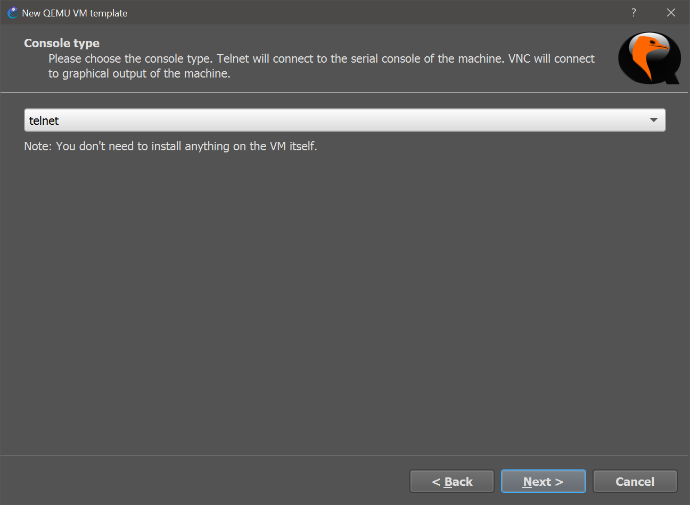
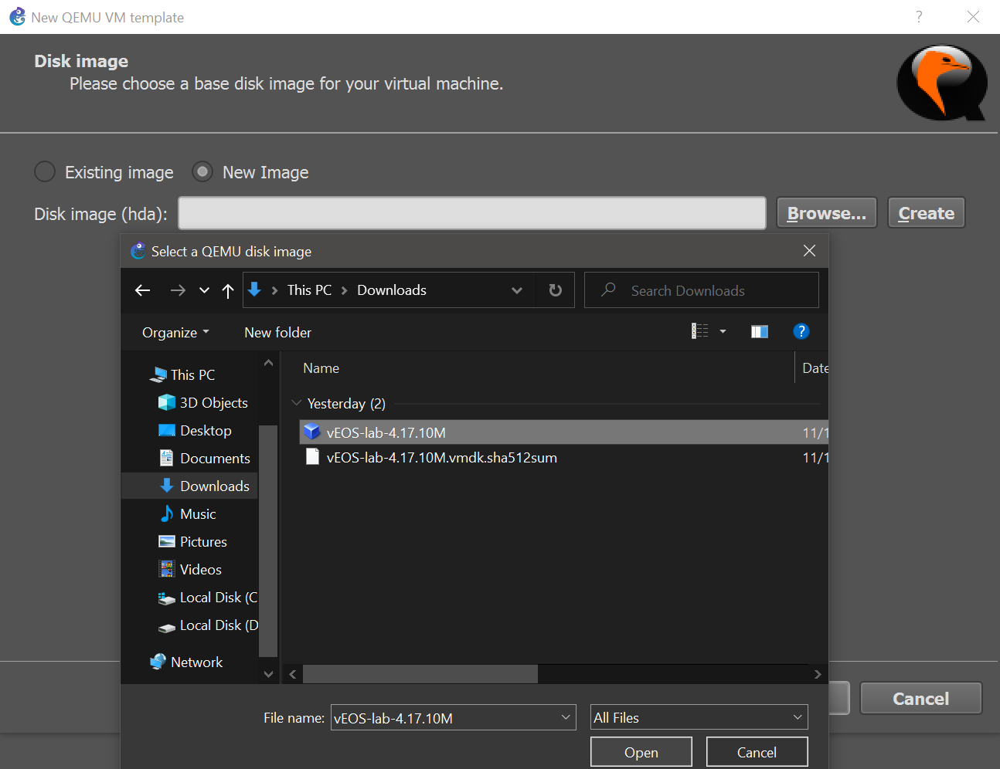
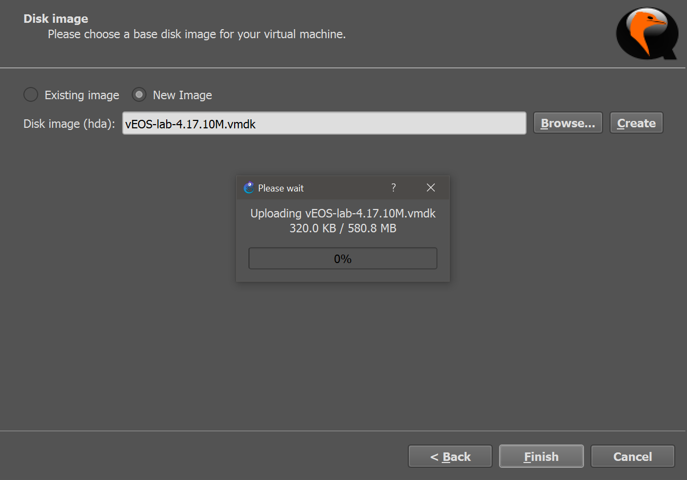
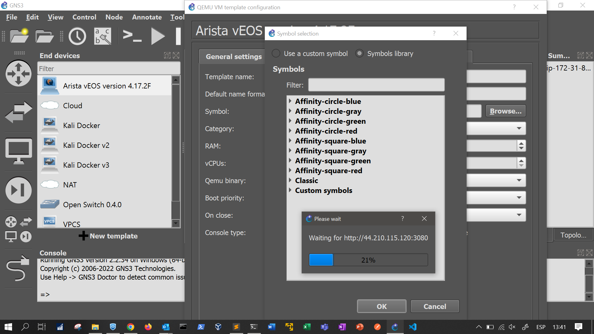
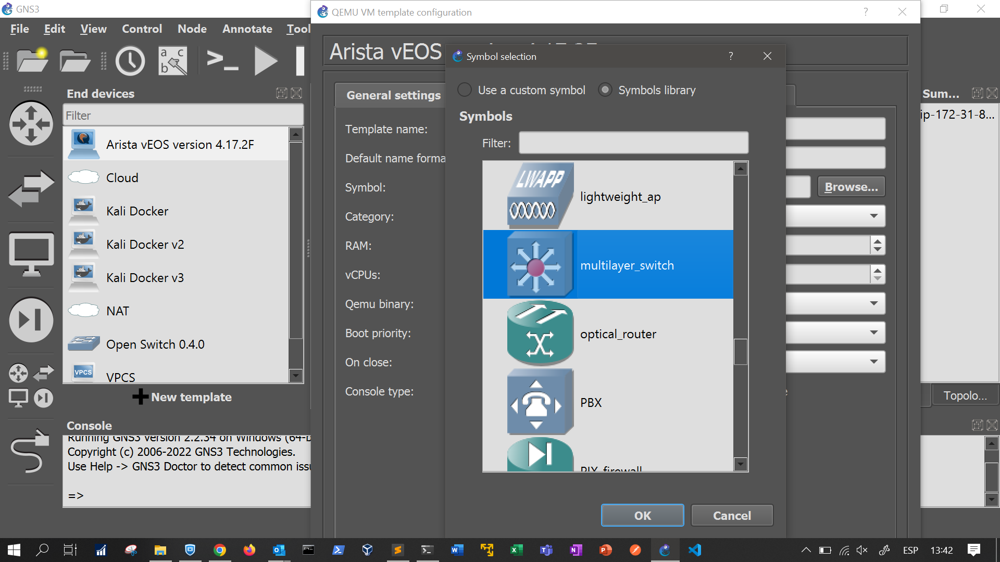
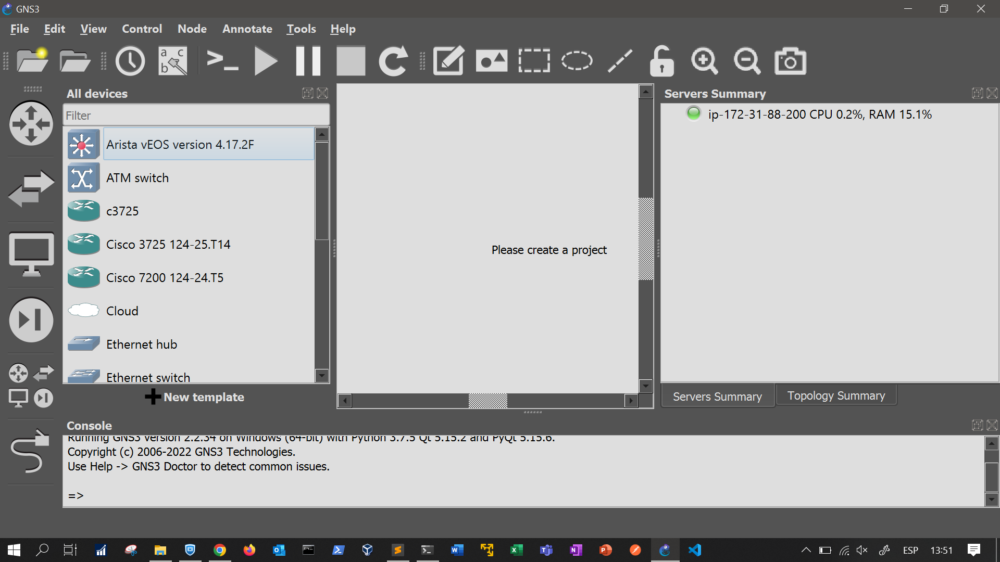
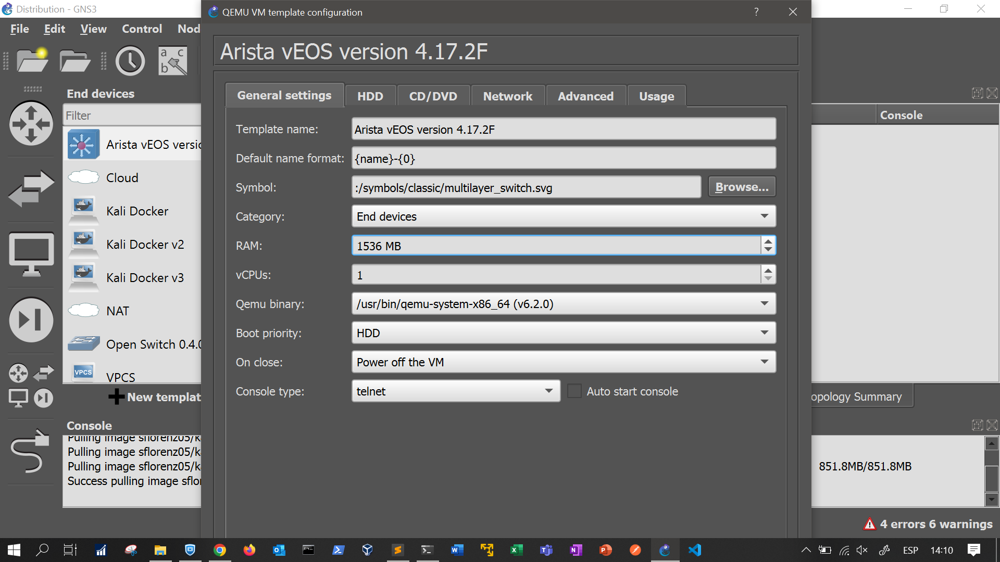

# Arista vEOS v4.17.2F Image

The distribution layer consists of two multilayer switches *vEOS-DIS-I* and *vEOS-DIS-II*. The switches are *Arista vEOS version 4.17.2F Qemu* appliances installed on VMware disks. Each appliance has assigned 1536 MB RAM.

The *Arista vEOS version 4.17.2F Qemu* Image can be downloaded as [VMDK](https://drive.google.com/drive/folders/160xpqTIni3UpblYrfXz-k-_fLqbRMMgT?usp=sharing) and imported to GNS3 following next steps:

1. Select VM from GNS3 preferences:

    

2. Name VM:

    

3. Define resources of VM:

    

4. Define access to VM:

    

5. Import VM:

    
    

6. Imported VM:

    

7. Search icon:

    

8. Change icon:

    

9. Apply and accept the Arista vEOS v4.17.2F imported:

    
