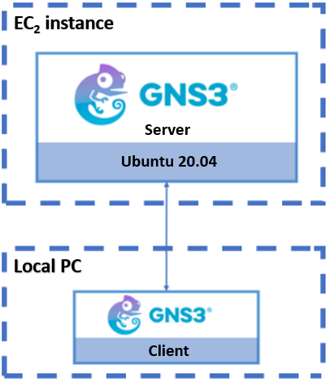
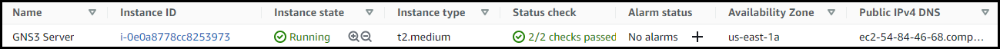
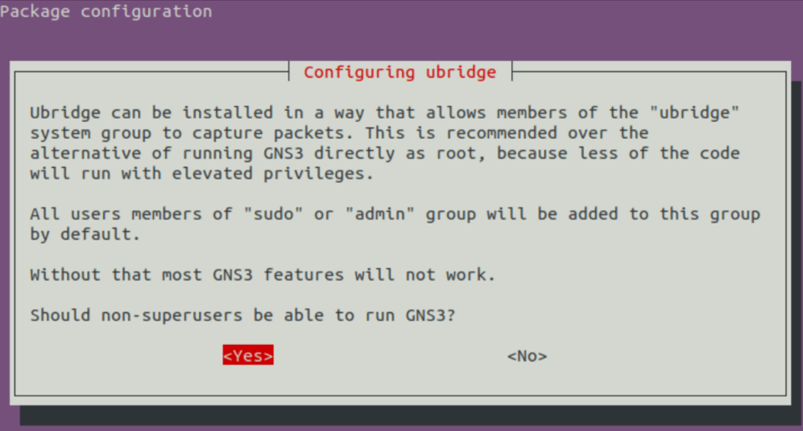
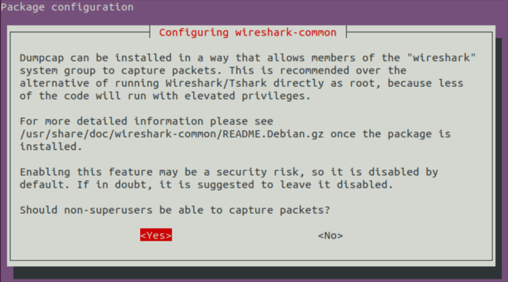
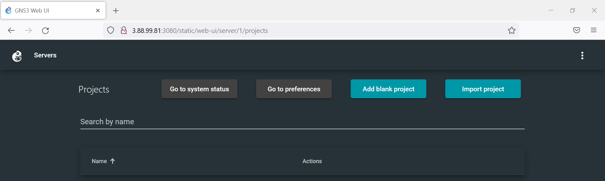
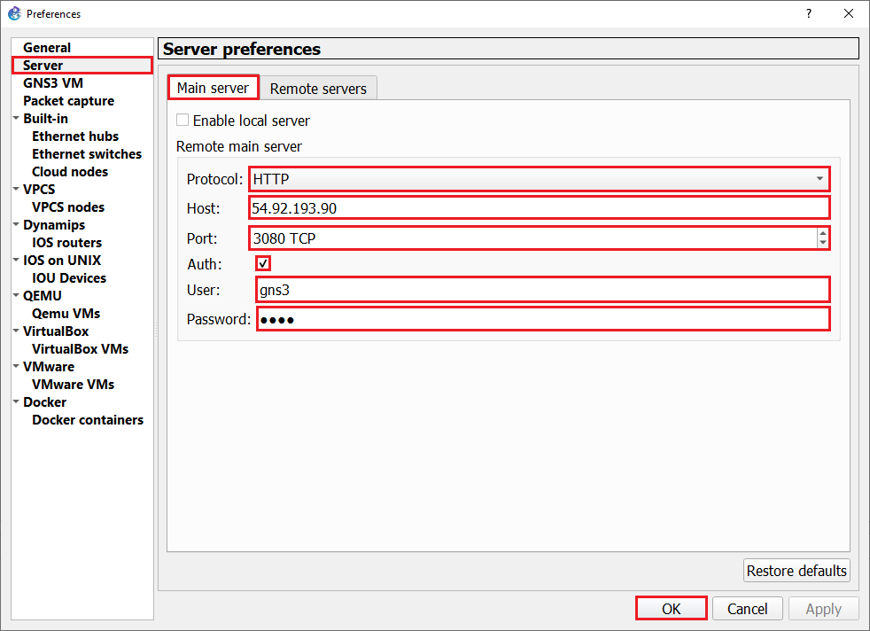
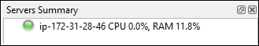
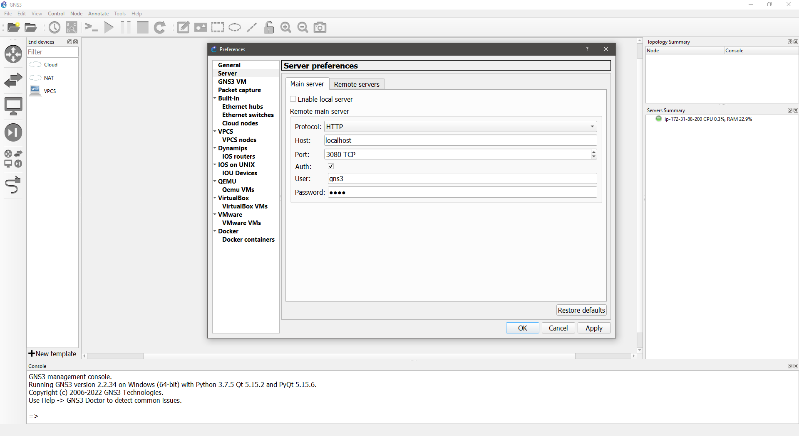

# Deployment of GNS3 server on EC2 instance

- [Deployment of GNS3 server on EC2 instance](#deployment-of-gns3-server-on-ec2-instance)
  - [Deploy GNS3 Server](#deploy-gns3-server)
  - [Connect to GNS3 Server from GNS3 client](#connect-to-gns3-server-from-gns3-client)
  - [How to bypass a network of restrictions by tunneling](#how-to-bypass-a-network-of-restrictions-by-tunneling)
  - [To Do](#to-do)

The purpose of this repository is to deploy a GNS3 server on an EC2 instance of AWS. The following figure shows the basic architecture of the deployment to be implemented:



## Deploy GNS3 Server

To perform the right deployment follow each of the following steps:

1. We assume that we have an EC2 instance deployed with Ubuntu Server 20.04 as OS:

    

2. The following rules apply for opening incoming connections from:

    | Type        | Port      | Description                                                     |
    |-------------|-----------|-----------------------------------------------------------------|
    | SSH         | 22        | Instance management                                             |
    | Custom TCP  | 3080      | GNS3 client-server connection                                   |
    | Custom TCP  | 5000-5030 | Telnet connection for the device management created within GNS3 |

    - Example of applied rules

    

3. GNS3 server installation:

    ```console
    sudo apt update
    sudo add-apt-repository ppa:gns3/ppa
    sudo apt install gns3-server gns3-gui
    ```

    - It is recommended accept both options as part of the installation process:

    | Users able to run GNS3| Users able to capture packages |
    |-------------|-----------|
    |  |  |

4. IOU (IOS over Unix) is an internal Cisco tool for simulating the ASICs in Cisco Switches. This enables you to play with Layer 2 switching in the Labs:

    ```console
    sudo dpkg --add-architecture i386
    sudo apt update
    sudo apt install gns3-iou
    ```

5. [Install Docker CE on Ubuntu 22.04|20.04|18.04](https://docs.docker.com/engine/install/ubuntu/).

    - Add your user account to docker group.

        ```console
        sudo usermod -aG docker $USER
        newgrp docker
        ```

    - Verify installation by checking Docker version:

        ```console
        docker version
        ```

    - After installing Docker and IOU, add your user to the following groups:

        ```console
        for i in ubridge libvirt kvm wireshark docker; do
            sudo usermod -aG $i $USER
        done
        ```

6. Run GNS3 server:

    ```console
    gns3server
    ```

    >Note: if you do not show logs on stdout use: `gns3server --quiet` or `gns3server -q`

   - It is now possible to access the GNS3 service:

    ```console
    http://aws_instance_ip:3080
    ```

   - Verify the service:

        

## Connect to GNS3 Server from GNS3 client

1. Now, it is time to connect to the server via the GNS3 client and configure the preferences properly.

    

   - Default username/password:

    ```console
    username: gns3
    password: gns3
    ```

2. Verify that the server has connected properly.

    

## How to bypass a network of restrictions by tunneling

If we are under a restrictive network with firewalls blocking the network, the following tunneling is proposed to bypass it.

```console
ssh -N -i key.pem -L localhost:3080:private_ip_ec2:3080 username_ec2@public_ip_ec2
```

For instance:

```console
ssh -N -i .\openstack.pem -L localhost:3080:172.31.88.200:3080 ubuntu@54.89.220.232
```

>**Note:** *For this mechanism to work, at least the access through port 22 must be open.*

- The following figure shows how the client must be configured so that the traffic is redirected through the tunnel:

    

## To Do

1. Enable secure connection between the client and server via TLS
2. Document how to apply rules on aws to open port
3. Document how to add a new router using binary files
