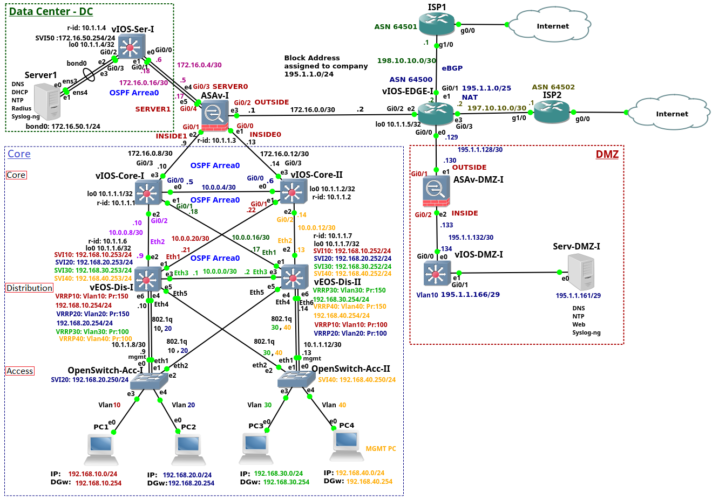

# GNS3 Base Network

- [GNS3 Base Network](#gns3-base-network)
  - [Prerequisites](#prerequisites)
  - [GNS3 network](#gns3-network)
    - [How to deploy GNS3 server](#how-to-deploy-gns3-server)
    - [Network base](#network-base)
      - [Configuration files](#configuration-files)
      - [Devices/Images used](#devicesimages-used)
  - [SDN](#sdn)

> **Note:** This repo is under development ⛏.
> > It is maintained by [Ziyao Wang](ziyao.wang@se19.qmul.ac.uk) and [Santiago Figueroa](sfigueroa@ceit.es) as part of the project: *Adaptive Countermeasure based on Software-Defined Networking for Industrial Control Systems*.

## Prerequisites

This repo requires the deployment of 2 instances (e.g. EC2 on AWS).

1. Dedicated to the installation of the GNS3 server which will contain the experimental base network.
2. Dedicated to SDN controller deployment

## GNS3 network
### How to deploy GNS3 server

1. Follow this instructions to [deploy the *GNS3 server* on an EC2 instance](./GNS3ServerDeployment/README.md).

### Network base

- This network consists of the *access*, *distribution* and *core* layers.

- The *data center (DC)* is composed of the layer 3 Cisco switch and the server. The design of the DC is very simplified as the network tiers are squeezed to a single switch layer 3 switch. The aim is to show configuration of the services running on the Server1 instead of discussing the complete DC design. 

- The company *edge router* is connected to the Internet using two *Internet Service Providers (ISPs)*. 

- The *Cisco ASA firewall* connects a campus network, data Center and the *edge router*. 

- The *edge router* connected *DMZ* to the rest of the enterprise network and to the Internet. The DMZ consists of the *Cisco ASA firewall*, layer 3 Cisco switch and the *DMZ* server.

- The enterprise is connected to the ISP1 and ISP2 routers via enterprise *edge router*. Both *ISP* routers  are bridged via *GNS3 clouds* to the server Ethernet Card in order to simulate connection to the Internet.

#### Configuration files

1. [Open Switch Access I](./config_files/OpenSwitch-Acc-I.txt)
2. [Open Switch Access II](./config_files/OpenSwitch-Acc-II.txt)
3. [Switch Distribution I](./config_files/vEOS-DIS-I.txt)
4. [Switch Distribution II](./config_files/vEOS-DIS-II.txt)
5. [Switch Core I](./config_files/vIOS-Core-I-1.txt)
6. [Switch Core II](./config_files/vIOS-Core-II-1.txt)
7. [Firewall CISCO ASA](./config_files/vASA-I.txt)
8. [Switch Datacentre](./config_files/vIOS-Serv-I.txt)
9. [Router Edge](./config_files/vIOS-EDGE-U.txt)
10. [Router ISP1](./config_files/ISP1.txt)
11. [Router ISP2](./config_files/ISP2.txt)
12. [Firewall CISCO ASA DMZ](./config_files/ASAv-DMZ-I.txt)
13. [Switch DMZ](./config_files/vIOS-DMZ-I.txt)

#### Devices/Images used

1. **Access Layer Switch** based on [Open Switch 0.4.0](./devices_images/open_switch/README.md) image.

## SDN

1. Follow this instructions to deploy the [SDN-Controller connected to a GNS3 network](./sdn-deployment/README.md).