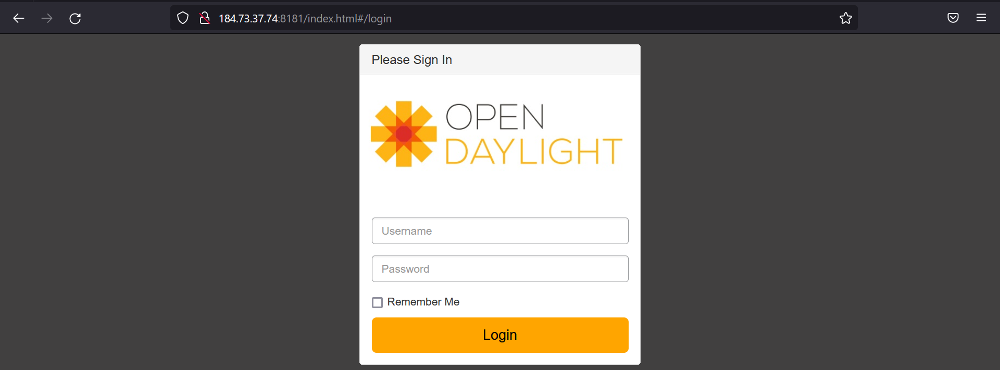

# Controller installation

- [Controller installation](#controller-installation)
  - [Prerequisites](#prerequisites)
  - [Deploy OpenDayLight](#deploy-opendaylight)

This section sets out the procedures for downloading and configuring the driver..

## Prerequisites

- Have instance `t2.medium` (*SDN-Controller*) deployed.
- Connection to this instance via `ssh`.
- [Install Docker on Ubuntu](https://docs.docker.com/engine/install/ubuntu/).

## Deploy OpenDayLight

> *Note:* The OpenDaylight Project is a collaborative open-source project hosted by the Linux Foundation. The project serves as a platform for software-defined networking for open, centralized, computer network device monitoring.

1. Launch container:

    ```console
     docker run -d --network host --name=opendaylight stephanfuhrmannionos/opendaylight:0.8.4
    ```

2. Connect to the container:

    ```console
    docker exec -ti opendaylight bin/client
    ```

   - Output:
  
     ```console
     Apache Karaf starting up. Press Enter to open the shell now...
     100% [========================================================================]
     Karaf started in 3s. Bundle stats: 54 active, 55 total

          ________                       ________                .__  .__       .__     __
          \_____  \ ______   ____   ____ \______ \ _____  ___.__.|  | |__| ____ |  |___/  |_
           /   |   \\____ \_/ __ \ /    \ |    |  \\__  \<   |  ||  | |  |/ ___\|  |  \   __\
          /    |    \  |_> >  ___/|   |  \|    `   \/ __ \\___  ||  |_|  / /_/  >   Y  \  |
          \_______  /   __/ \___  >___|  /_______  (____  / ____||____/__\___  /|___|  /__|
                  \/|__|        \/     \/        \/     \/\/            /_____/      \/


     Hit '<tab>' for a list of available commands
     and '[cmd] --help' for help on a specific command.
     Hit '<ctrl-d>' or type 'system:shutdown' or 'logout' to shutdown OpenDaylight.

     opendaylight-user@root> 
     ```

3. Refresh Karaf features

     ```console
     feature:repo-refresh
     ```

4. Install Karaf features:

     - To install a feature, use the following command, where feature1 is the feature name listed in the table below:

          ```console
          feature:install <feature1>
          ```

     - You can install multiple features using the following command:

          ```console
          feature:install <feature1> <feature2> ... <featureN-name>
          ```

     1. odl-l2switch-switch
     2. odl-l2switch-all
     3. odl-dlux-core
     4. odl-dluxapps-yangutils
     5. features-dlux
     6. odl-dluxapps-applications
     7. odl-dluxapps-yangvisualizer
     8. odl-dluxapps-topology
     9. odl-dluxapps-nodes
     10. odl-restconf-all
     11. odl-netconf-topology
     13. odl-yanglib
     14. odl-mdsal-all
     15. odl-openflowplugin-southbound

          ```console
          feature:install odl-l2switch-switch odl-dlux-core odl-dluxapps-yangutils features-dlux odl-dluxapps-applications odl-dluxapps-yangvisualizer odl-dluxapps-topology odl-dluxapps-nodes odl-restconf-all odl-openflowplugin-southbound odl-l2switch-all odl-netconf-topology odl-yanglib odl-mdsal-all
          ```  

5. To check the list of features:

    ```console
    feature:list
    ```

6. `OpenDaylight` exposed TCP ports in AWS inbound rules:
   - `6633` Openflow,
   - `8101` Karaf CLI via SSH (see below),
   - `8181` RESTCONF / HTTP

7. Through the browser, and using the public IP of the instance (e.g.: `http://35.174.155.88:8181/index.html#/login`) we can see the controller's web interface.

    1. Use the default credencials:

          ```console
          Username: admin
          Password: admin
          ```

          
