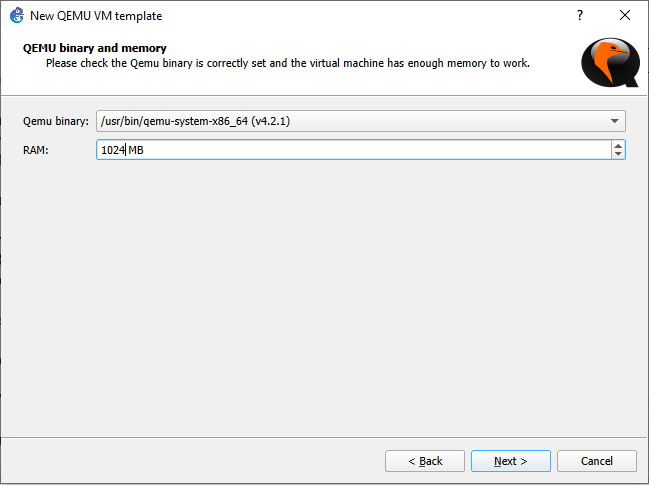
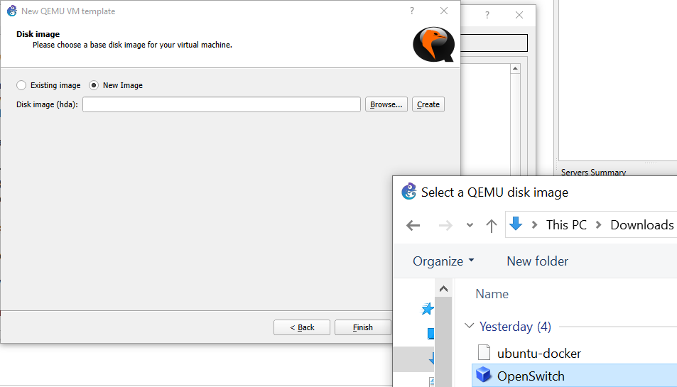

# Legacy Open Switch 0.4.0 Image

The Open Switch 0.4.0 is the legacy Open Switch version with Cisco like CLI. This image must be used for learning demonstration purpose only because this Open Switch version is discontinued. Instead, use the Open Switch OPX version 2.0.0 (and upwards) that is entirely new product, with Linux like CLI. The OPX version is actively developed and can be downloaded from http://archive.openswitch.net/.

The Open Switch 0.4.0 Image can be downloaded as [VMDK](https://drive.google.com/file/d/1bdv_pekvpovMS-ewJ4TVpCesBca0-JP9/view?usp=sharing) and imported to GNS3 following next steps:

1. Select VM from GNS3 preferences:

    

2. Name VM:

    

3. Define resources of VM:

    

4. Define access to VM:

    

5. Import VM:

    

6. Imported VM:

    
