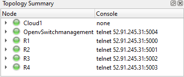

# GNS3-Network and SDN-Controller integration

## OpenVSwitch - SDN-Controller Connection

- Si se observa la topología de la red, se pueden observar los puertos `telnet` asignados, de manera que a través de la ejecusión del comando `telnet 52.91.245.31 5004` permitirá realizar las siguientes configuraciones en el *OpenVSwitch*.

    

- Una vez establecidos estos parámetros se procede a conectar el OVS con el controlador. OpenDayLight ha de estar lanzado en el momento que se intente hacer la conexión. La conexión se hará a través del puerto 6633.

```console
ovs-vsctl set bridge br0 protocols=OpenFlow10 -- set-controller br0 tcp:54.152.14.26:6633
```

- Los siguientes comandos son una colección de comandos útiles para comprobar si la conexión y configuración es correcta y/o comprobar las tablas de flujo establecidas por el controlador.

```console
ovs-vsctl list controller
ovs-vsctl list bridge br0
ovs-ofctl -O OpenFlow13 dump-flows br0
ovs-ofctl -O OpenFlow13 dump-ports br0
```

- Por ejemplo, el output del comando `ovs-vsctl list controller` debería ser:

```console
/ # ovs-vsctl list controller
_uuid               : 4c55b0df-8aa1-45a5-b3c5-ff2b35de2d9d
connection_mode     : []
controller_burst_limit: []
controller_rate_limit: []
enable_async_messages: []
external_ids        : {}
inactivity_probe    : []
is_connected        : true
local_gateway       : []
local_ip            : []
local_netmask       : []
max_backoff         : []
other_config        : {}
role                : other
status              : {sec_since_connect="2", state=ACTIVE}
target              : "tcp:54.152.14.26:6633"
type                : []
```
