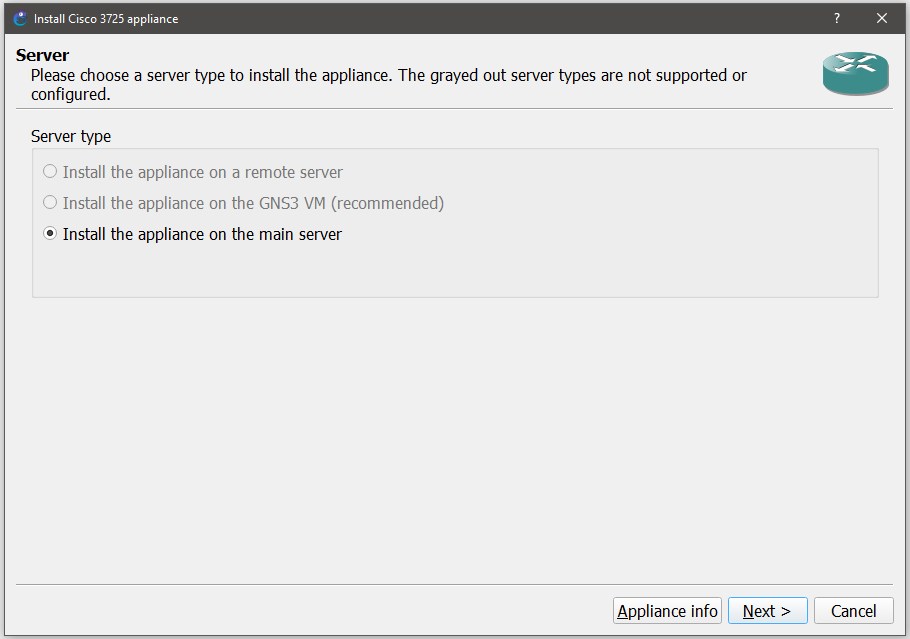
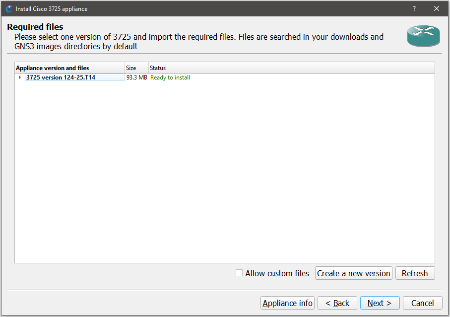
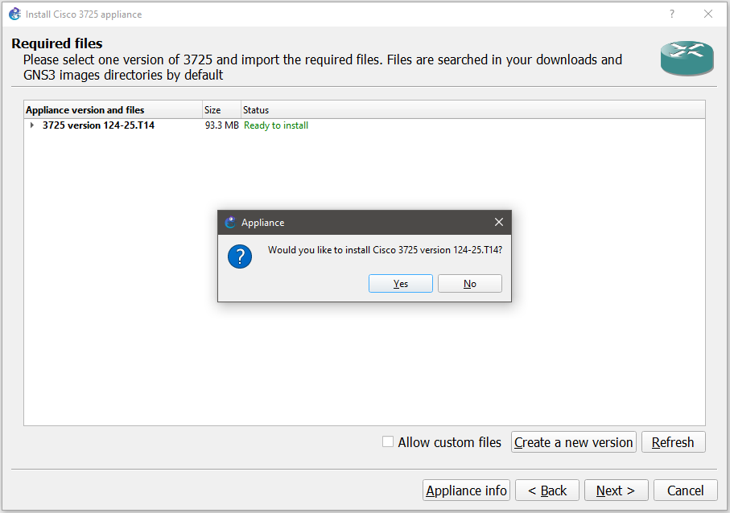
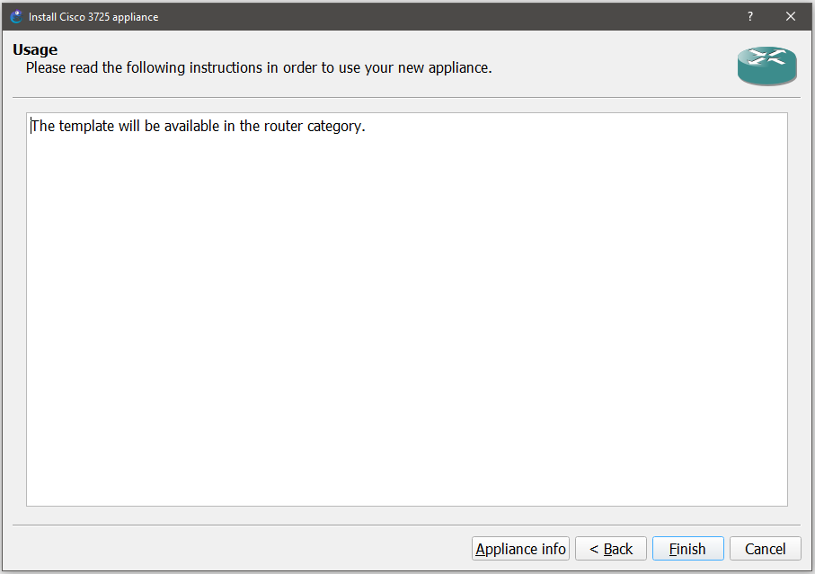
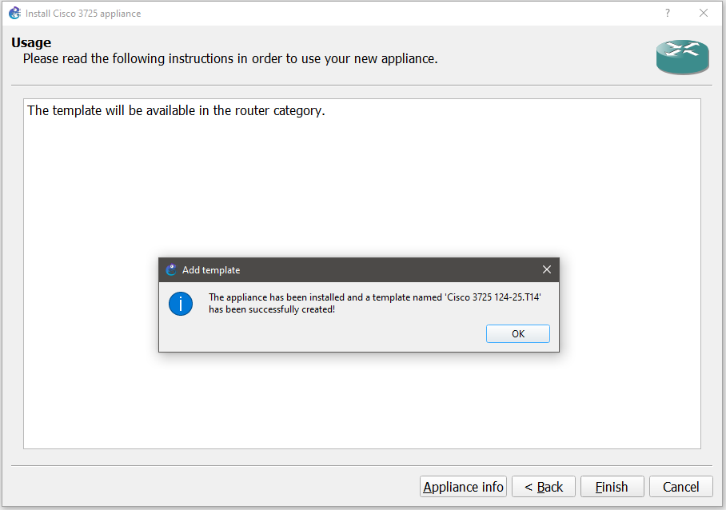
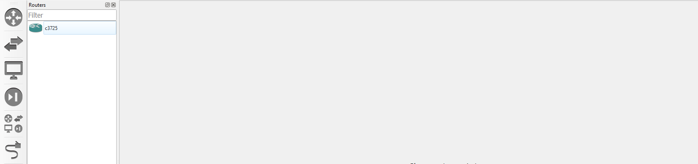
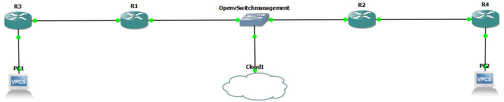
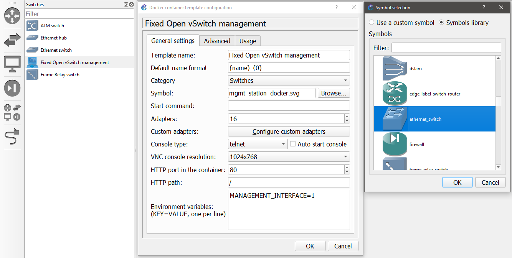
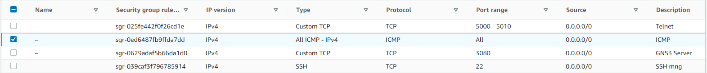

# GNS3 Network Deployment

- [GNS3 Network Deployment](#gns3-network-deployment)
  - [Pre-requisitos](#pre-requisitos)
  - [Instalación de Dispositivos](#instalación-de-dispositivos)
  - [Despliegue de la red Tipo](#despliegue-de-la-red-tipo)
    - [Configuración de interfaces en enrutadores](#configuración-de-interfaces-en-enrutadores)
    - [Configuración de OSPF en los enrutadores](#configuración-de-ospf-en-los-enrutadores)
    - [Acceso de OpenVSwitch a internet](#acceso-de-openvswitch-a-internet)
    - [Incluir Hosts](#incluir-hosts)

Esta sección establece los procedimientos para descargar y configurar la red GNS3.

## Pre-requisitos

- Tener la instancia `t2.large` (*GNS3-Server*) desplegada
- Conexión a dicha instancia vía `ssh`.
- Conexión vía GNS3 client a esa instancia.
  - Implica tener abierto el puerto 3080 (Detalle comentado en la [instalación de GNS3](../../GNS3ServerDeployment/README.md#deploy-gns3-server)).
- Conexión vía Telnet a esa instancia.
  - Implica tener abierto el rango de puertos 5000 - 50010 (Detalle comentado en la [instalación de GNS3](../../GNS3ServerDeployment/README.md#deploy-gns3-server)).

## Instalación de Dispositivos

- La carpeta `ApplianceImageGNS3` contiene todas las imágenes que serán importadas de la siguiente manera, usando la de `cisco-3725` como muestra:

1. Se descarga la imagen correspondiente al router `cisco-3725` ubicada en `~/TelematicsNetworkDesign/SDN-Lab/ApplianceImageGNS3`.
2. Después, en GNS3, vamos a *File*, *Import appliance*, se localiza el directorio donde se tiene la *imágen descargada* y *Abrir*.
3. Seleccionar instalar el dispositivo en el servidor principal:

    

4. Seleccionar la imagen del router `cisco-3725`:

    

5. Aceptar la instalación de la imagen del router `cisco-3725`:

    

6. Terminar el proceso de instalación de la imagen del router `cisco-3725`:

    

7. Recibir mensaje de imagen del router `cisco-3725` instalada:

    

8. Verificar que la imagen del router `cisco-3725` ha sido instalada

    

## Despliegue de la red Tipo

1. Crear un nuevo proyecto en `File` y `New blank project` para empezar a desplegar la red.
2. Se deben importar los appliance según la arquitectura siguiente, así como conectarlos entre si:

  

> **Note:**: *Por defecto al importar el *appliance* Open vSwitch aparece con un ícono que debe ser cambiado.*

  

### Configuración de interfaces en enrutadores

- Para R1:

  ```console
  configure terminal
  interface f0/0
  ip address 10.1.1.1 255.255.255.0
  no shutdown
  end
  ```

  ```console
  configure terminal
  interface f0/1
  ip address 10.1.2.1 255.255.255.0
  no shutdown
  end
  ```

  - Se guardara la configuración del enrutador R1 introduciendo el comando:

  ```console
  copy running-config startup-config
  ```

- Para R3

  ```console
  configure terminal
  interface f0/0
  ip address 10.1.2.2 255.255.255.0
  no shutdown
  end
  ```

  ```console
  configure terminal
  interface f0/1
  ip address 10.1.4.1 255.255.255.0
  no shutdown
  end
  ```

  - Se guardara la configuración del enrutador R1_1 introduciendo el comando:

  ```console
  copy running-config startup-config
  ```

- Para R2

  ```console
  configure terminal
  interface f0/0
  ip address 10.1.1.2 255.255.255.0
  no shutdown
  end
  ```

  ```console
  configure terminal
  interface f0/1
  ip address 10.1.3.1 255.255.255.0
  no shutdown
  end
  ```

  - Se guardara la configuración del enrutador R2 introduciendo el comando:

  ```console
  copy running-config startup-config
  ```

- Para R4

  ```console
  configure terminal
  interface f0/0
  ip address 10.1.3.2 255.255.255.0
  no shutdown
  end
  ```

  ```console
  configure terminal
  interface f0/1
  ip address 10.1.5.1 255.255.255.0
  no shutdown
  end
  ```

  - Se guardara la configuración del enrutador R2_2 introduciendo el comando:

  ```console
  copy running-config startup-config
  ```

### Configuración de OSPF en los enrutadores

- Para hacer que los routers operen bajo el protocolo habrá que configurarlos de la siguiente manera (todos igual).

  ```console
  configure terminal
  router ospf 1
  network 10.0.0.0 0.255.255.255 area 0
  end
  ```

- Se guardara la configuración del enrutador R2_2 introduciendo el comando:

  ```console
  copy running-config startup-config
  ```

- Debería existir comunicación entre routers, por ejemplo de R1 a R4:

  ```console
  R1#ping 10.1.5.1

  Type escape sequence to abort.
  Sending 5, 100-byte ICMP Echos to 10.1.5.1, timeout is 2 seconds:
  !!!!!
  Success rate is 100 percent (5/5), round-trip min/avg/max = 24/30/36 ms
  ```

- Se podría comprobar la existencia de vecinos:

  ```console
  R1#show ip ospf neighbor

  Neighbor ID     Pri   State           Dead Time   Address         Interface
  10.1.3.1          1   FULL/DR         00:00:30    10.1.1.2        FastEthernet0/0
  10.1.4.1          1   FULL/DR         00:00:31    10.1.2.2        FastEthernet0/1
  ```

### Acceso de OpenVSwitch a internet

En este paso se debe habilitar el acceso del `OpenVSwitch` a internet de manera que pueda conectarse al controlador SDN.

Como se muestra en la siguiente figura se debe:

1. Seleccionar los end devices en el cliente GNS3.
2. Arrastrar el Cloud hacia el proyecto.
3. Doble clic encima del ícono de la nube.
4. Habilita el checkbox `show special interfaces`.
5. Seleccionar y agregar la interfaz `virbr0`.
6. Conectar la interfaz `eth0` del `OpenVSwitch` a la `virbr0` de la nube.

    

7. Inspeccionar las interfaces de la instancia de AWS vía `ip addr` para verificar que la interfaz `virbr0` esté habilitada.

    ```console
    3: virbr0: <BROADCAST,MULTICAST,UP,LOWER_UP> mtu 1500 qdisc noqueue state UP group default qlen 1000
      link/ether 52:54:00:45:6a:2e brd ff:ff:ff:ff:ff:ff
      inet 192.168.122.1/24 brd 192.168.122.255 scope global virbr0
         valid_lft forever preferred_lft forever
    ```

8. Una vez conocida la IP de la interfaz de red, se procede a configurar OVS para tener acceso a internet, y, por consiguiente, a la instancia donde estará desplegado el controlador. Para conseguir esto se requieren dar dos pasos: asignarle una IP adecuada a la interfaz eth0 y abrir un gateway hacia la interfaz de red que dará acceso a internet

    ```console
    ifconfig eth0  192.168.122.101
    ip route add default via 192.168.122.1
    ```

9. Se verifica la conexión enviando paquetes ICMP desde el controlador hacia internet

    ```console
    ping 8.8.8.8
    ```

> **Note**: *Es posible que sea necesario generar una regla de entrada en la instancia EC2 para habilitar el acceso vía ICMP.*

  

> **Note:**: *Fuera del scope de este ejercicio queda habilitar la salida a internet desde los enrutadores.*

### Incluir Hosts

El VPSC, disponible por defecto en GNS3, es el hosts que conectaremos al extremo de la red. La configuración a aplicar en este caso es simplemente agregar las IPs en las interfaces que se conectan. 

- PC1

```console
show ip
ip 10.1.4.2/24 10.1.4.1
```

- PC2

```console
show ip
ip 10.1.5.2/24 10.1.5.1
```
